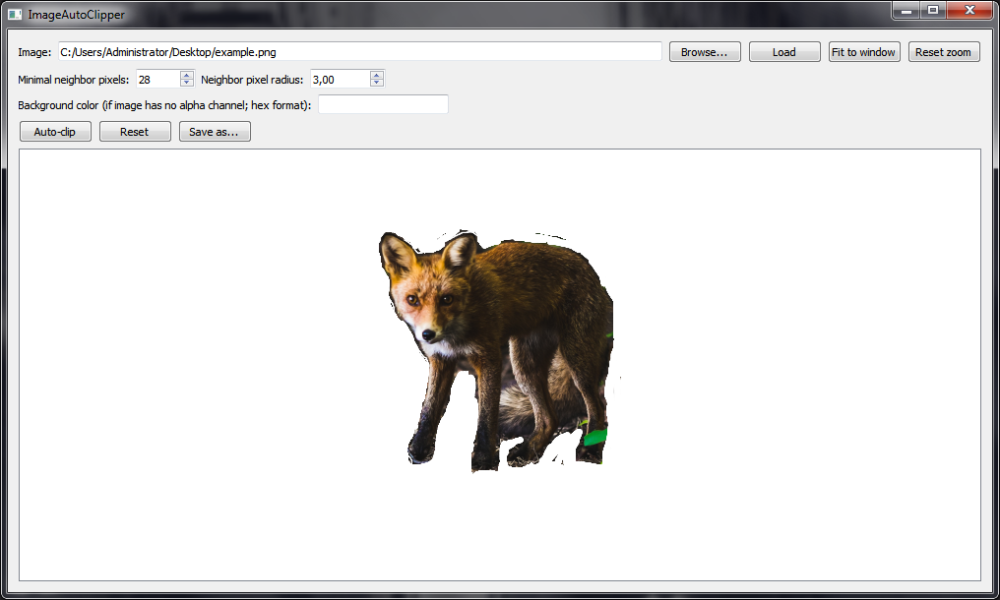

# ImageAutoClipper

Program for auto-clipping images by removing "stray" pixels, with adjustable parameters. Written in Qt/C++.

## Download

Download link: [Win32 binary](https://github.com/Extender/ImageAutoClipper/raw/master/bin/imageautoclipper-v1.0-bin-win32.zip)

## Screenshots

### Input

### Output (clipped)

